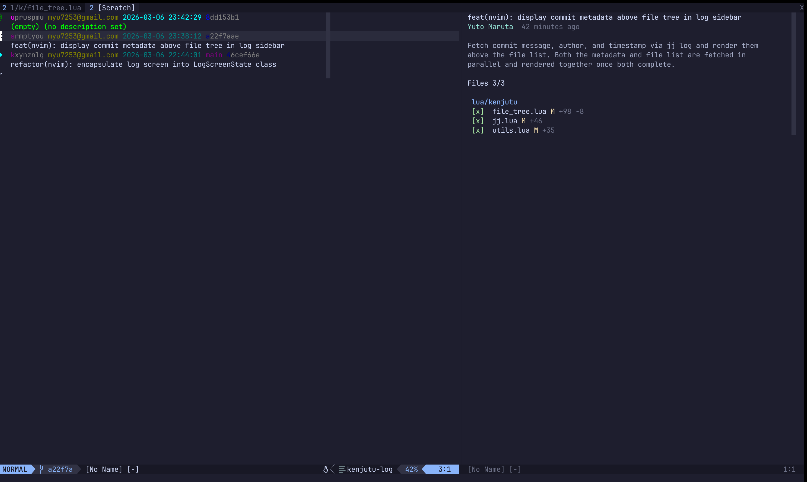
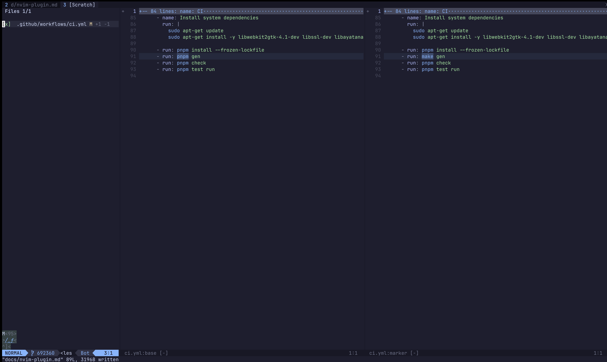

# Kenjutsu Neovim Plugin

<video src="https://github.com/user-attachments/assets/e6c8ae3e-aad4-48f0-ba23-6d0be6c381a8" autoplay loop muted playsinline></video>

A Neovim plugin for browsing jj commit logs and reviewing diffs in Jujutsu
repositories — with hunk-level review tracking, all without leaving your editor.

|          log view           |           diff view           |
| :-------------------------: | :---------------------------: |
|  |  |

## Features

- **`:Kenjutsu log`** — Browse your jj commit graph with colored output
- **Split diff views** — Side-by-side base, marker, and target views using native Vim diff
- **Hunk-level review** — Mark hunks as reviewed with `s` (uses `diffput`/`diffget` under the hood)
- **File list** — Navigate changed files and toggle their review status
- **Review persistence** — Review state is saved as git objects via marker commits and survives rebases
- **Comments** — Add comments to diff lines, view threads, and navigate between comments
- **Squash** — Move changes between commits directly from the log screen, with optional file selection

## Prerequisites

- [Neovim](https://neovim.io/) (0.11+)
- [Jujutsu](https://martinvonz.github.io/jj/) (`jj` CLI, v0.38+)

## Installation

The plugin requires a `kjn` binary. You can either download a prebuilt binary or
build from source:

| Method            | Command            | Requirements                                     |
| ----------------- | ------------------ | ------------------------------------------------ |
| Prebuilt binary   | `make install-kjn` | Linux (x86_64, aarch64) or macOS (Apple Silicon) |
| Build from source | `make build-kjn`   | [Rust toolchain](https://rustup.rs/)             |

The plugin automatically locates `kjn` from the plugin directory — no PATH setup
needed.

### lazy.nvim

```lua
{
  "Yuki-bun/kenjutsu",
  build = "make install-kjn", -- prebuilt binary
  -- or
  build = "make build-kjn", -- build from source (requires Rust toolchain)
}
```

### vim.pack

```lua
-- Register `kjn` install/update autocmd. This autocmd must be registered before vim.pack.add() call
vim.api.nvim_create_autocmd("PackChanged", {
  callback = function(ev)
    local name, kind = ev.data.spec.name, ev.data.kind
    if name == "kenjutsu" and (kind == "install" or kind == "update") then
      if not ev.data.active then
          vim.cmd.packadd("kenjutsu")
      end
      vim.system({ "make", "install-kjn" }, { cwd = ev.data.path }) -- prebuilt binary
      -- or
      vim.system({ "make", "build-kjn" }, { cwd = ev.data.path }) -- build from source (requires Rust toolchain)
    end
  end,
})

vim.pack.add({ "https://github.com/Yuki-bun/kenjutsu" })
```

### Manual

Clone the repository into your Neovim pack path, then run `make install-kjn`
(or `make build-kjn`) from the plugin directory.

## Usage

### Commands

```
:Kenjutsu log    " Open the jj commit log
```

### Keybindings

#### Log Screen

| Key     | Action                                 |
| ------- | -------------------------------------- |
| `j`     | Move to next commit                    |
| `k`     | Move to previous commit                |
| `<CR>`  | Open review screen for selected commit |
| `d`     | Edit commit description                |
| `s`     | Start squash (or confirm destination)  |
| `S`     | Squash with file picker                |
| `<Esc>` | Cancel squash mode                     |
| `r`     | Refresh the commit log                 |
| `q`     | Close the log screen                   |

#### Review — File List (left pane)

| Key       | Action                                  |
| --------- | --------------------------------------- |
| `j`       | Move selection down                     |
| `k`       | Move selection up                       |
| `<CR>`    | Focus to the diff pane                  |
| `<Space>` | Toggle file reviewed/unreviewed         |
| `r`       | Refresh the file list                   |
| `t`       | Toggle diff mode (remaining ↔ reviewed) |
| `q`       | Close the review screen                 |

#### Review — Diff Pane (right pane)

| Key     | Action                                        |
| ------- | --------------------------------------------- |
| `s`     | Mark hunk as reviewed (normal mode)           |
| `s`     | Mark selected lines as reviewed (visual mode) |
| `<Tab>` | Focus back to file list                       |
| `gj`    | Jump to next file                             |
| `gk`    | Jump to previous file                         |
| `t`     | Toggle diff mode (remaining ↔ reviewed)       |
| `gc`    | Add a comment on the current line             |
| `go`    | Open comment thread at cursor                 |
| `gC`    | Open comment list for current file            |
| `]x`    | Jump to next comment                          |
| `[x`    | Jump to previous comment                      |
| `q`     | Close the review screen                       |

The diff pane uses native Vim diff mode, so all standard diff motions work:

| Key  | Action                         |
| ---- | ------------------------------ |
| `]c` | Jump to the next diff hunk     |
| `[c` | Jump to the previous diff hunk |
| `zo` | Open a fold                    |
| `zc` | Close a fold                   |
| `zR` | Open all folds                 |
| `zM` | Close all folds                |

### Squash

Squash lets you move changes from one commit into another without leaving the
log screen. There are two modes: full squash and selective (file picker) squash.

#### Full squash

1. Navigate to the source commit and press `s` to enter squash mode. The source
   line is highlighted.
2. Navigate to the destination commit and press `s` again to execute.
3. If both commits have descriptions, a commit message buffer opens. Edit the
   combined message and press `:w` to confirm.
4. Press `<Esc>` or `s` on the same source commit to cancel.


#### Selective squash (file picker)

1. Navigate to the source commit and press `S`. A file picker opens above the
   log showing all changed files in that commit.
2. Toggle individual files with `<Space>`. All files start selected.
3. Press `<CR>` to confirm your selection and enter squash destination mode.
   Press `q` or `<Esc>` to cancel.
4. Navigate to the destination commit and press `s` to execute.
5. If both commits have descriptions, a commit message buffer opens. Edit the
   combined message and press `:w` to confirm.

Only the selected files are moved to the destination.


#### File picker keybindings

| Key         | Action             |
| ----------- | ------------------ |
| `<Space>`   | Toggle file on/off |
| `<CR>`      | Confirm selection  |
| `q`/`<Esc>` | Cancel file picker |

### Comments

Leave inline comments on diff lines directly from the review screen. Comments
can be added on the base (old) and target (new) panes, but not on the middle
review state pane.

#### Adding comments


1. In the diff pane, move the cursor to the line you want to comment on.
2. Press `gc` to open the comment input float. In visual mode, `gc` creates a
   multi-line comment spanning the selection.
3. Type your comment and press `:w` to save, or `q` to cancel.

A `▎` sign appears next to commented lines. Navigate between comments with `]x`
and `[x`.

#### Viewing threads and replying


Move the cursor to a line with a `▎` sign and press `go` to open the comment
thread in a floating window. The thread shows the original comment, any replies,
and timestamps. Press `q` to close.

#### Comment list


Press `gC` in the diff pane to open the comment list for the current file. All
comments are shown with their line numbers, sides (old/new), and resolved status.
Resolved comments and code blocks are folded by default. Use `zo`/`zc` to open
and close folds.

| Key    | Action                     |
| ------ | -------------------------- |
| `<CR>` | Open the comment thread    |
| `x`    | Toggle resolved/unresolved |
| `q`    | Close the comment list     |

#### Resolving comments

Mark a comment as resolved by pressing `x` in the comment list or thread view.
Resolved comments show a `[resolved]` tag and are folded in the comment list.
Press `x` again to unresolve.

## Architecture

The plugin has two parts:

**Lua plugin** (`/lua/kenjutsu`) — Handles the UI: rendering the commit graph, managing
diff windows, tracking keybindings, and displaying review state.

**Rust CLI backend** (`/src-nvim`, binary `kjn`) — Does the heavy lifting: reading git
objects, computing diffs, resolving file trees, and managing marker commits. The Lua
plugin calls `kjn` as a subprocess and parses its JSON output.
